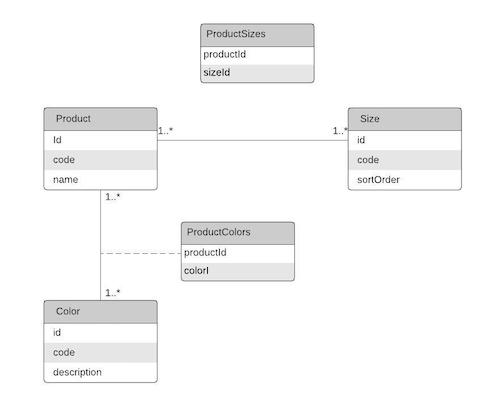

# Spring Boot with Liquibase and R2DBC

This is a Demo project which purpose is to showcase a small service that uses [Liquibase](https://www.liquibase.org/) for a tutorial I'm writing. During the making of this project I wanted to also try a Reactive approach to connect with the Database by using [R2DBC](https://spring.io/projects/spring-data-r2dbc). 

The API reads from a database with the following tables and relations.



## Requirements 

- [Docker Desktop](https://www.docker.com/products/docker-desktop) - To run your contenerized PostgreSQL database
- [Postman](https://www.postman.com/downloads/) - To test the API

Additionally, these are the versions of some of the most important dependencies used in the project

- Java 11
- Spring Boot 2.4.2
- Liquibase Plugin 2.0.4

## Running this project

1. Install [Docker Desktop](https://www.docker.com/products/docker-desktop) if you haven't.

2. Run the script [`re-start-local-postgres.sh`](scripts/re-start-local-postgres.sh) located in the `scripts` folder to spin up your Postgres database.
```shell script
scripts/stop-local-postgres.sh    
```

3. Run the app with gradle
```
 ./gradlew clean bootRun
```
When the app run the Liquibase plugin will run too and the [`main-changelog.yml`](src/main/resources/db/changelog/main-changelog.yml) will execute all the database changes on it. 

## Available endpoints

This project includes a Postman Collection that you can download to see requests examples for each endpoint. The following table describes briefly each endpoint.

| Method   | Endpoint                        | Description                                                                                                                                                                                                                 |
|----------|---------------------------------|-----------------------------------------------------------------------------------------------------------------------------------------------------------------------------------------------------------------------------|
| `GET`    | `/sizes`                        | List all available sizes. This project contains pre-defined sizes, uploaded through a Liquibase dataset, check the [`dataset.prod.sql`](src/main/resources/db/changelog/dataset.prod.sql) file.                                                                                 |
| `GET`    | `/colors`                       | List all available colors. This project contains pre-defined colors, uploaded through a Liquibase dataset, check the [`dataset.prod.sql`](src/main/resources/db/changelog/dataset.prod.sql) file.                                                                               |
| `GET`    | `/products`                     | List all available products, by default is empty. Use the `POST /products` endpoint to add products.                                                                                                                        |
| `GET`    | `/products/{product_id}`        | Get the details of a specific product. By default the products table is empty. Use the `POST /products` endpoint to add products.                                                                                           |
| `POST`   | `/products`                     | Creates a product, you can include colors and sizes associated to the product. See the Postman Collection included in the project to see a request example.                                                                 |
| `PUT`    | `/products/{product_id}`        | Updates a product including its associated colors and size. See the Postman Collection included in the project to see a request example. If no colors or sizes are included all associated colors or sizes will be removed. |
| `DELETE` | `/products/{product_id}`        | Deletes a product and the colors and sizes associated to it.                                                                                                                                                                |
| `GET`    | `/products/{product_id}/colors` | List the colors associated to a product. Notice you get the same colors when requesting the details of a product.                                                                                                           |
| `GET`    | `/products/{product_id}/sizes`  | List the sizes associated to a product. Notice you get the same sizes when requesting the details of a product.                                                                                                             |